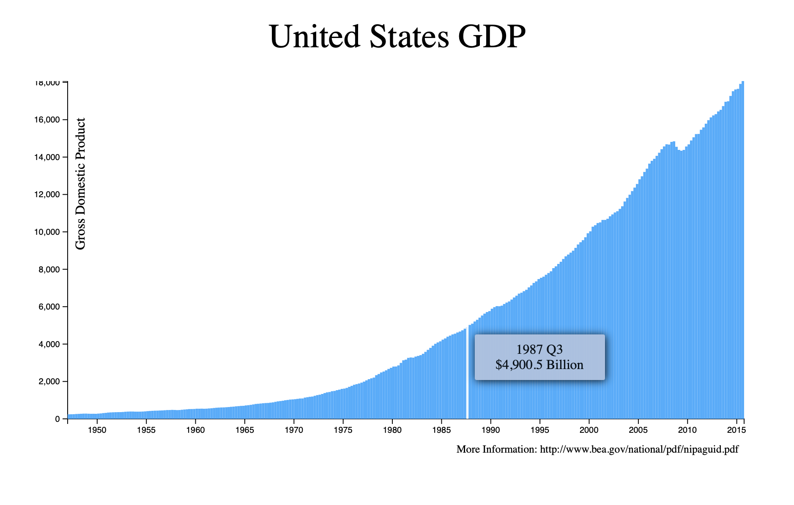
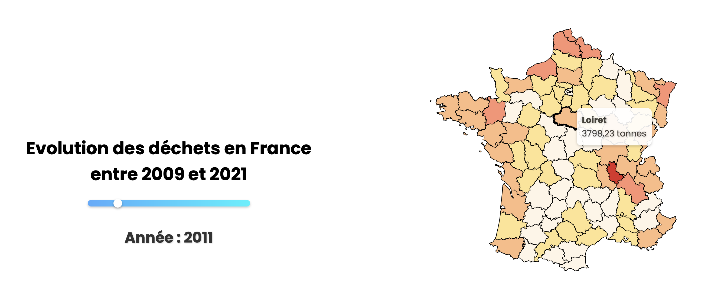
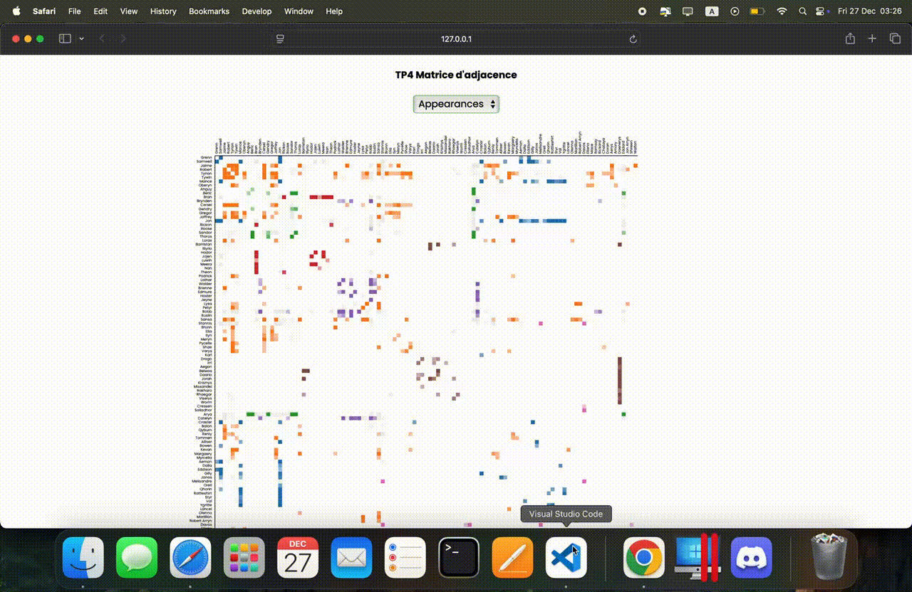

## Description du dépot

Ce dépot contient les TP réalisés dans le cadre du cours de Data Visualization à l'Université Claude Bernard Lyon 1 avec les technologies **HTML**, **CSS** et **D3js**

### TP1 : Visualisation de l'évolution du GDP des Etats-Unis (freecodecamp)

### TP2 : Visualisation de l'évolution des déchets en france entre 2009 et 2021

### TP3 : Matrice d'adjacence des personnages de Games of Thrones

### Ressources additionelles
Voir également le projet réalisé dans le cadre de cette UE : [Cliquez](https://ismailchakrane.github.io/StreamViz/)
